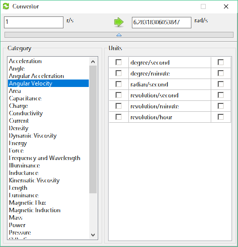
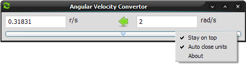

# Convertor

### Convertor is a free and open source unit converter written in object pascal

## Highlights

  1. **Free** - Free to download, free to use, and free to change if you want.
 
  2. **Open source** - The whole program is written in [Free Pascal](http://www.freepascal.org) using the [Lazarus](http://lazarus.freepascal.org) widget set, so it is working on windows, mac, linux and whatever lazarus is running on.

  3. **Self Contained** - It is only one executable and one XML file containing all the unit conversion factors. After it is run for the first time it will create a short convertor.ini file where the executable is located. Thats it! No writing to the registry or other files scattered around the file system.

  4. **No surprises** - Convertor will not use the network to 'call home' or check for updates, and will not download patches or anything. It works and that's it. You are always welcome to check for newer versions of-coarse!

  5. **Simple to use** - Once you get the hang of it, it is simple to use. It is based on two concepts:
      * There is only one list of units for every category.
      * The right and left edit boxes act as inputs and outputs.

  6. **Minimal** - Convertor is designed to be minimal so as not to get in the way, it is just a helper program after all. Use it 'on top' of other programs, and hide it when not in use. t is possible to hide or even auto-hide the unit list after picking, it is true minimalism..

## Quickstart

Fire up the application, and it should resemble the next image (see the red numbers
for the description that follows):

  1.  On this paticular image, the conversion is done from the left input box to the right, and the category and unit lists are visible. The direction of conversion is determined by placing the mouse in one of the input boxes.

  2.  The left list is the category list. Click on a category and the unit list will change accordingly.

  3.  The right list is the unit list in each category. Left click on a unit will choose that unit for the left input box, right click on a unit will choose that unit for the right input box.

  4.  Click this long button and the two lists will hide. Another click will show them again.

When the lists are hidden the Convertor window takes minimum screen real estate. The next image shows the Convertor with the lists hidden.

On this image the conversion is done from right to left, notice the green arrow has changed direction. Also visible is the popup menu which pops whenever the
right mouse button is clicked (but not when the mouse is over the unit list). 
The options are:
  *  **Stay on top** - Convertor will stay on top of other program windows.
  *  **Auto close units** - The units will auto hide when clicking in one of the input boxes.
  *  **About** - Well, about...

## Build

Convertor is written in object pascal, and is using the [free pascal](http://www.freepascal.org) compiler and the [lazarus](http://lazarus.freepascal.org) widgets and library. So first go ahead and install Lazarus, it will install fpc with it.

  1. Install lazarus on your system.
  2. Clone this [repo](https://github.com/hdrz/convertor) and open convertor.lpi in lazarus.
  3. Compile.

## License

It is licensed under [GPL3](gpl-3.0.txt).